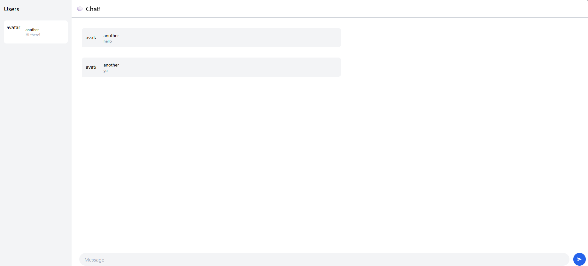
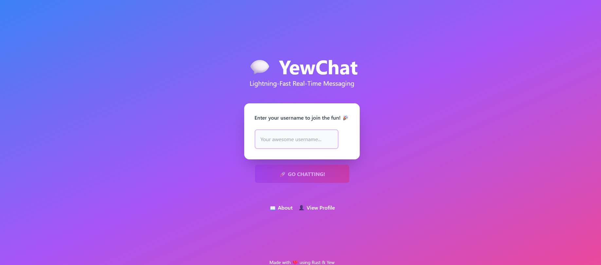
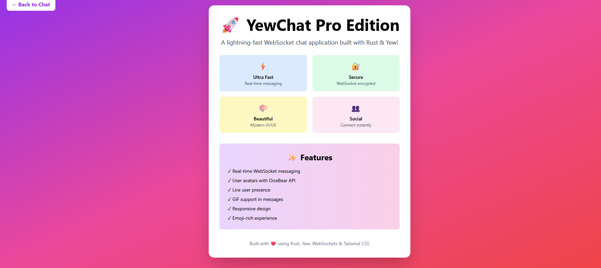
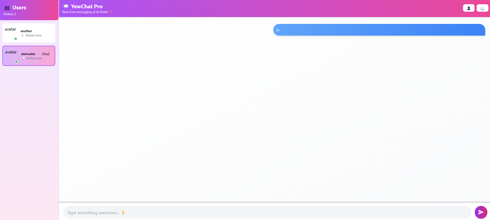
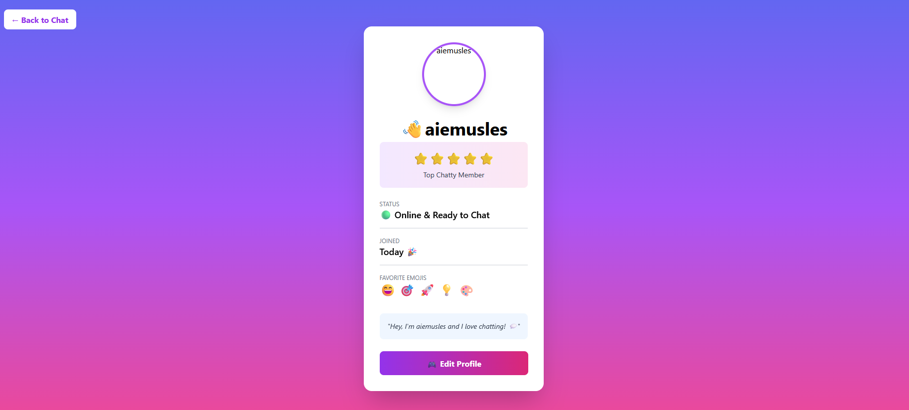

# Source: YewChat 💬

> Source code for [Let’s Build a Websocket Chat Project With Rust and Yew 0.19 🦀](https://fsjohnny.medium.com/lets-build-a-websockets-project-with-rust-and-yew-0-19-60720367399f)

## Install

1. Install the required toolchain dependencies:
   ```npm i```

2. Follow the YewChat post!

## Branches

This repository is divided to branches that correspond to the blog post sections:

* main - The starter code.
* routing - The code at the end of the Routing section.
* components-part1 - The code at the end of the Components-Phase 1 section.
* websockets - The code at the end of the Hello Websockets! section.
* components-part2 - The code at the end of the Components-Phase 2 section.
* websockets-part2 - The code at the end of the WebSockets-Phase 2 section.


## Experiment 3.1
Webchat Screenshot:


## Experiment 3.2:
### New Features Added:

1. **About Page** 
   - Beautiful gradient design showcasing YewChat Pro
   - Feature highlights with colorful emoji icons
   - Technical details about the application
   - Accessible from login page and chat interface

2. **User Profile Page** 
   - Personalized user avatar (generated with DiceBear API)
   - User status indicator (🟢 Online & Ready to Chat)
   - Achievement badges and member status
   - Personalized welcome messages
   - Profile navigation from chat interface

3. **Enhanced Chat Interface** 
   - Modern gradient header (purple-to-pink) with navigation buttons
   - User list with online status indicators
   - Current user highlighting in the user list
   - Different message bubble styles for sent (blue) vs received (gray)
   - Empty state with helpful prompts
   - Improved input field with focus effects
   - Quick navigation to Profile and About pages

4. **Beautiful Login Page** 
   - Full-screen gradient background (blue → purple → pink)
   - Large app branding with emoji
   - Creative placeholder text and motivational messages
   - Smooth button styling and disabled states
   - Links to About and Profile pages
   - Made-with-love attribution

5. **UI/UX Improvements** 
   - Gradient backgrounds throughout the application
   - Smooth CSS animations and transitions
   - Custom scrollbar with purple gradient styling
   - Hover effects and scale transforms on buttons
   - Rounded corners and shadow effects for depth
   - Extensive emoji usage for visual personality
   - Color-coded message bubbles for better UX
   - Responsive design for all screen sizes
   - Focus ring effects on input fields

### Images:
Front page

About

Chat

User profile

